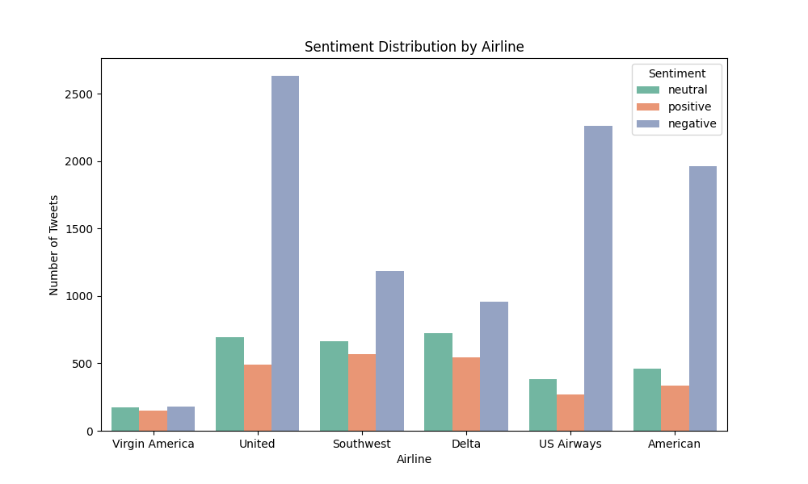
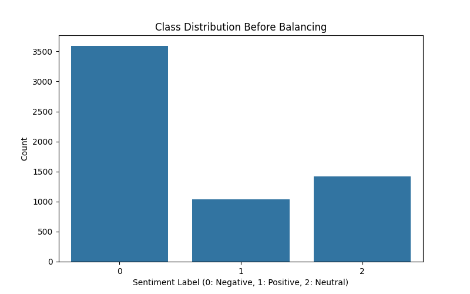
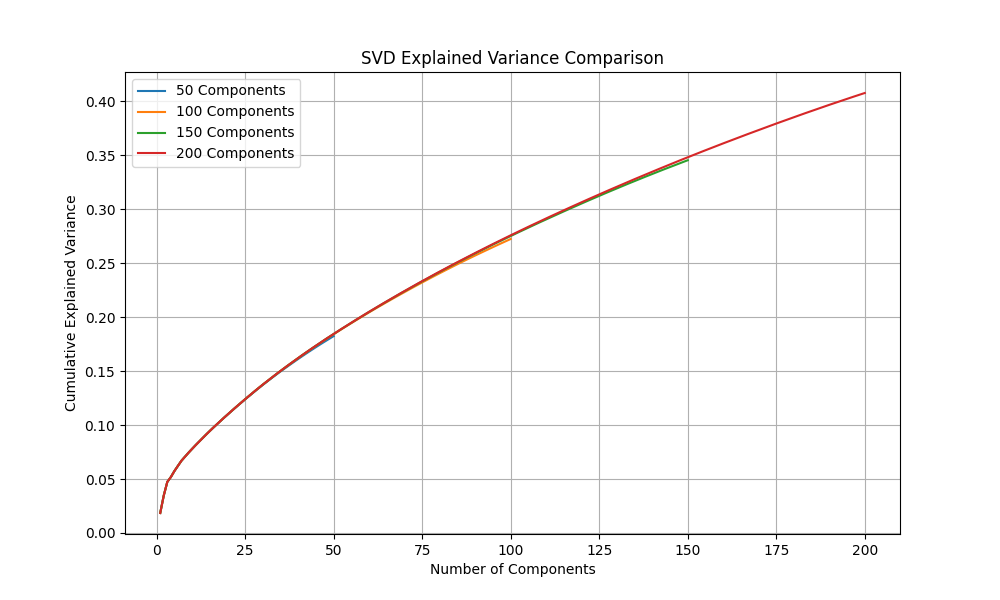
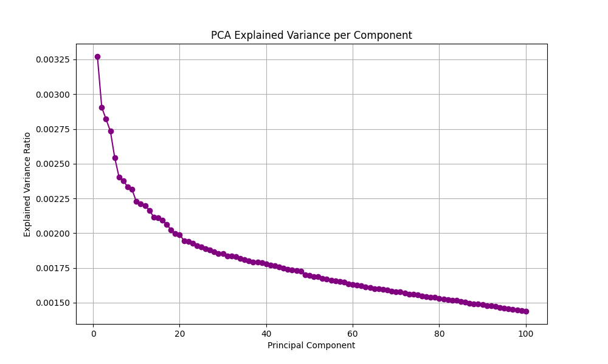
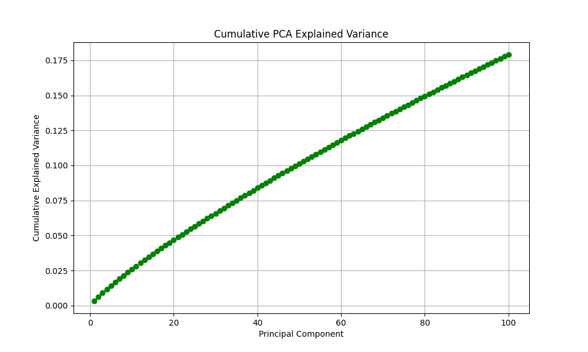
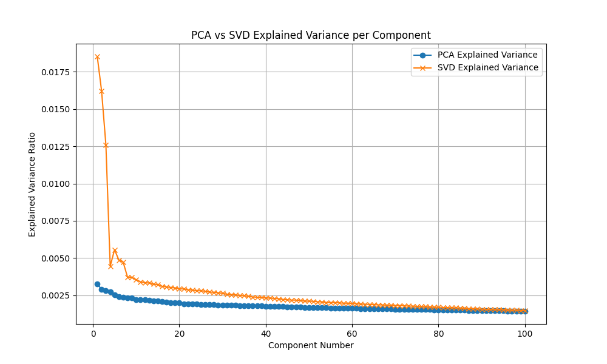
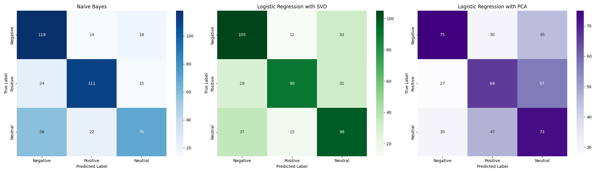

# **Text Classification with Dimensionality Reduction**

###  Group 2 — Machine Learning Project

In this notebook, we explore how different dimensionality-reduction methods impact sentiment classification on an airline tweets dataset. We compare baseline TF-IDF models with SVD and PCA to discover which method gives the best performance — and why!

---

## **Project Overview**

This project explores machine learning techniques to classify airline tweets into three sentiment categories: negative, positive, and neutral. We begin by transforming raw tweet text into numerical TF-IDF features, followed by evaluating a baseline Naive Bayes classifier. To improve efficiency and examine semantic structure, we apply two dimensionality reduction methods—SVD and PCA—and train Logistic Regression models on the reduced feature sets. Performance is compared using accuracy, classification reports, confusion matrices, and variance analysis. The project highlights how dimensionality reduction impacts sentiment prediction and demonstrates that SVD better preserves textual meaning than PCA.

We classify tweets into three sentiment categories:

| Label | Sentiment |
| ----- | --------- |
| **0** | Negative  |
| **1** | Positive  |
| **2** | Neutral   |

---

# **To Run Our Project**

## **Prerequisites**

Make sure you have the following installed:

* Python **3.11+**
* Jupyter Notebook or JupyterLab

You can install everything using:

```bash
pip install -r requirements.txt
```

---

## **Running the Notebook**

### **Jupyter Notebook**

1. Open a terminal in the project folder.
2. Launch Jupyter Notebook:

   ```bash
   jupyter notebook
   ```
3. Open **text_classification_dimensionality_reduction_group2.ipynb**.
4. Run all cells sequentially from **top to bottom**.
5. The notebook will automatically:

   * Load the dataset
   * Preprocess and vectorize tweets
   * Train the Naive Bayes, SVD, and PCA models
   * Generate confusion matrices, performance tables, and variance plots

---

## 📂 **Project Structure**

```
📁 project-folder
│── 📄 README.md
│── 📄 Tweets.csv
│── 📄 text_classification_dimensionality_reduction_group2.ipynb
│── 📄 requirements.txt
│── 📁 images/     
```

---


## **Dataset**

`Description`

We got our dataset from Kaggle ([Link](https://www.kaggle.com/datasets/crowdflower/twitter-airline-sentiment/data))
The Twitter US Airline Sentiment dataset, released by CrowdFlower (now Figure Eight), contains 14,640 tweets directed at six major U.S. airlines: American, United, Southwest, Delta, US Airways, and Virgin America. Each tweet is manually labeled with one of three sentiments—negative, neutral, or positive—making it a high-quality dataset for supervised sentiment analysis.

`Insight`

We work with an airline sentiment dataset containing thousands of tweets.
Here’s how sentiments are distributed across major airlines:





From this, we note:

* Negative tweets **dominate** across all airlines
* Positive feedback is consistently the smallest category
* Neutral tweets are moderately represented

This imbalance affects model behavior — especially misclassifications.

---

## **Text Vectorization with TF-IDF**

We convert tweets into numerical features using TF-IDF, creating a sparse, high-dimensional matrix representing word importance.
This forms the baseline for all models in the pipeline.


## **Baseline Performance – Naive Bayes**

| Metric            | Score    |
| ----------------- | -------- |
| Accuracy          | **0.66** |
| Weighted F1-Score | **0.66** |

**Naive Bayes performs surprisingly well**, especially on sparse text data.
It sets the benchmark we compare later models against.

---

## **Dimensionality Reduction**

### 1️⃣ **SVD (Truncated SVD / LSA)**

* Captures *latent semantic structure*
* Works well on sparse text
* Higher explained variance in first components



### 2️⃣ **PCA**

* Requires dense, standardized data
* Variance spread is low
* Performs poorly on sparse TF-IDF





### 📉 PCA vs SVD Explained Variance



**Takeaway:**
🔸 SVD captures far more useful information early
🔸 PCA loses semantic meaning → harms model performance

---

## **Logistic Regression Results**

### **With SVD**

| Metric            | Score    |
| ----------------- | -------- |
| Accuracy          | **0.65** |
| Weighted F1-Score | **0.65** |

Balanced performance with strong semantic preservation.

### **With PCA**

| Metric            | Score    |
| ----------------- | -------- |
| Accuracy          | **0.48** |
| Weighted F1-Score | **0.48** |

PCA struggles because it reduces the rich semantics of text into low-variance projections.

---

## 🧩 **Confusion Matrix Comparison**




---

## 📝 **Model Comparison Summary**

| Model                         | Accuracy | Best Strength                | Weakness                                        |
| ----------------------------- | -------- | ---------------------------- | ----------------------------------------------- |
| **Naive Bayes**               | ⭐ 0.66   | Fast, strong baseline        | Struggles with neutral class                    |
| **SVD + Logistic Regression** | ⭐ 0.65   | Preserves semantic structure | Small drop from TF-IDF baseline                 |
| **PCA + Logistic Regression** | ⚠️ 0.48  | Reduces dimensionality by capturing the directions of maximum variance                         | Loses semantic meaning, many misclassifications |

---

## 🧠 **Key Takeaways**

* **SVD is the best dimensionality reduction method for text.**
* PCA removes too much meaning → poor model accuracy.
* Naive Bayes remains a powerful baseline on sparse TF-IDF data.
* Airline sentiment is heavily skewed negative, impacting classification difficulty.

---

## **Future Improvements**

To enhance model performance:

 Use deep learning models (CNNs, LSTMs, BERT)
 Improve text preprocessing
 Use more features (hashtags, emojis, metadata)
 Handle class imbalance via oversampling or class weighting
 Explore topic modeling or transformer embeddings


Github URL:
https://github.com/Albrightmaduka9053136/text-classification-dimensionality-reduction-group2.git

## Group 2 Members (Authors)
- Albright Maduka Ifechukwude - 9053136
- Abdullahi Abdirizak Mohamed - 9082466
- Kamamo Lesley Wanjiku - 8984971